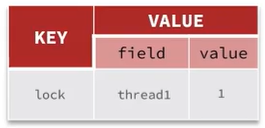
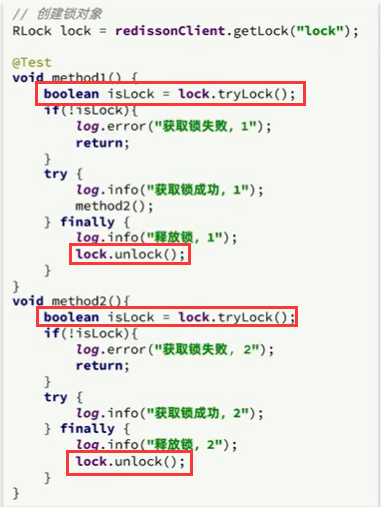
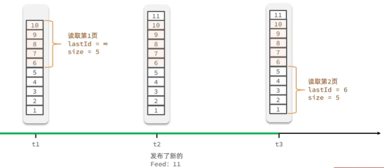

## 登录模块
通过采用多个拦截器来刷新redis中token的有效期

在查询商品模块 通过返回空字符串或者null来预防缓存穿透，同时通过逻辑过期的方法来放置缓存击穿
在更新商品模块 通过先更新数据库在删除redis中的数据的方式以及开启事务的方式来达到数据的一致性

## 乐观锁实现下单
~~~ java
 if (voucher.getStock() < 1) {
            return Result.fail("库存不足！");
        }
        //5，扣减库存
        boolean success = seckillVoucherService.update()
                .setSql("stock= stock -1")
                .gt("stock", 0).update();
        if (!success) {
            return Result.fail("库存不足！");
        }
~~~
通过在查询语句的时候用>减少出错
```java
 if (voucher.getStock() < 1) {
        // 库存不足
        return Result.fail("库存不足！");
    }
    //5，扣减库存
    boolean success = seckillVoucherService.update()
            .setSql("stock= stock -1")
            .eq("voucher_id", voucherId).update();
    if (!success) {
        //扣减库存
        return Result.fail("库存不足！");
    }
```
等于号出错比较高

 ## 在实现用户一单的悲观锁
一些注意事项
```
首先不建议把锁加在方法上，因为任何一个用户来了都要加这把锁，而且是同一把锁，方法之间变成串行执行，性能很差。

因此可以把锁加在用户id上，只有当id相同时才会对锁形成竞争关系。但是因为toString的内部是new了一个String字符串，每调一次toString都是生成一个全新的字符串对象，锁对象会变。

所以可以调用intern()方法，intern()方法会优先去字符串常量池里查找与目标字符串值相同的引用返回（只要字符串一样能保证返回的结果一样）。

但是因为事务是在函数执行结束之后由Spring进行提交，如果把锁加在createVoucherOrder内部其实有点小——因为如果解锁之后，其它线程可以进入，而此时事务尚未提交，仍然会导致安全性问题。

因此最终方案是把synchronized加在createVoucherOrder的方法外部，锁住的是用户id。

关于代理对象事务的问题：通常情况下，当一个使用了@Transactional注解的方法被调用时，Spring会从上下文中获取一个代理对象来管理事务。

但是如果加@Transactional方法是被同一个类中的另一个方法调用时，Spring不会使用代理对象，而是直接调用该方法，导致事务注解失效。

为避免这种情况，可以使用AopContext.currentProxy方法获取当前的代理对象，然后通过代理对象调用被@Transactional注解修饰的方法，确保事务生效。
```

## 自己实现分布式锁
注意yd要用finally解锁
~~~ java
Long userId = UserHolder.getUser().getId();
        SimpleRedisLock lock = new SimpleRedisLock("order:" + userId, stringRedisTemplate);
        boolean isLock = lock.tryLock(1200);
        //加锁失败
        if (!isLock) {
            return Result.fail("不允许重复下单");
        }
        try {
            //获取代理对象(事务)
            IVoucherOrderService proxy = (IVoucherOrderService) AopContext.currentProxy();
            return proxy.createVoucherOrder(voucherId);
        } finally {
            lock.unlock();
        }
~~~

## 删除锁的优化
防止误删别人的锁
```java
public void unlock() {
    // 获取线程标示
    String threadId = ID_PREFIX + Thread.currentThread().getId();
    // 获取锁中的标示
    String id = stringRedisTemplate.opsForValue().get(KEY_PREFIX + name);
    // 判断标示是否一致
    if(threadId.equals(id)) {
        // 释放锁
        stringRedisTemplate.delete(KEY_PREFIX + name);
    }
}
```

## redisson可重复锁的原理
ReentrantLock可重入锁的原理：获取锁的时候在判断这个锁已经被占有的情况下，会检查占有锁的是否是当前线程，如果是当前线程，也会获取锁成功。会有一个计数器记录重入的次数。

会通过下面的结构来记录某个线程重入了几次锁。

每释放一次锁采用的策略是把重入次数减1。

加锁和释放锁是成对出现的，因此当方法执行到最外层结束时，重入的次数一定会减为0。

1.是否存在锁

2.存在锁，判断是否是自己的。

是，锁计数+1。

不是，获取锁失败。

3.不存在锁

## redisson的锁重试与watchdog机制
锁的重试是用消息订阅的方式来实现的，也就是说在等锁的过程中在没收到通知前是被阻塞状态。
解决因为业务阻塞而导致提前释放锁
锁超时释放：利用看门狗机制，每隔一段时间，重置超时时间。
释放锁机制：
尝试释放锁，判断是否成功
    释放成功。
        发送锁释放的消息（与获取锁的失败重试关联）
    取消看门狗机制（与自动更新锁过期时间关联）
        1.2 释放失败。返回异常。

## 阻塞队列优化秒杀

阻塞队列：尝试从队列获取元素，如果没有元素会被阻塞，直到队列中有元素才会被唤醒，获取元素。  

只要类一启动，用户随时都有可能来抢购，因此VoucherOrderHandler这个类的初始化必须在类初始化后执行。

在VoucherOrderServiceImpl类中，首先要新增一个orderTasks阻塞队列，然后设置一个线程池和run方法。

在run方法中调用阻塞队列的take方法，orderTasks.take方法是一个阻塞方法，如果队列中有元素会获取，如果队列中无元素则阻塞等待。

这里相当于是开启了一个全新的线程来执行获取队列中订单信息和异步创建订单的任务：
### 步骤
因此步骤是在保存优惠券的时候先放到redis，当要抢购的时候放到阻塞队列，一直处理

## stream队列的消费者模式
消费者组（Consumer Group）：将多个消费者划分到一个组中，监听同一个队列。消费者之间是竞争关系。

1.消息分流：队列中的消息会分流给组内不同消费者，而不是重复消费，从而加快消息处理的速度。

2.消息标示：消费者组会维护一个标示（类似于标签，记录读到哪里了），记录最后一个被处理的消息，哪怕消费者宕机重启，还会从标示之后读取消息，确保每一个消息都会被消费。

3.消息确认（解决消息丢失问题）：消费者获取消息后，消息处于pending状态，并存入一个pending-list。当处理完成后需要通过XACK来确认消息，标记消息为已处理，才会从pending-list移除。

## 点赞功能的排行 选用SortedSet
在显示是否点赞的时候，可以采用set集合，因为每个用户只能点赞一次，但是因为还要给用户进行排序，因此选择用sortedset来进行
通过查询top5的点赞用户 zrange key 0 4
Set<String> top5 = stringRedisTemplate.opsForZSet().range(key, 0, 4);
的方式渲染到屏幕上

## 好友的共同关注 采用set的交集
通过获取自己的好友列表，以及好友的好友列表，然后做交集即可
Set<String> intersect = stringRedisTemplate.opsForSet().intersect(key, key2);
其中key与key2是两个集合

## 推送粉丝收件箱 sortedSet集合
Feed流中的数据会不断更新，所以数据的角标也在变化，因此不能用传统的分页模式。因此用滚动分页模式：

每一次都记住上一次查询分数的最小值，将最小值作为下一次的最大值
不过要注意sortedset集合的实现方式

## 附近商铺 GEO数据结构
将数据库表中的数据导入到redis中去，redis中的GEO，GEO在redis中就一个menber和一个经纬度，把x和y轴传入到redis做的经纬度位置去，不过不能把所有的数据都导入进去，因为会导致内存不够用，导入id即可，然后根据前端传过来的进行比较即可

## 用户签到 bitmap
把年和月作为bitMap的key，然后保存到一个bitMap中，每次签到就到对应的位上把数字从0变成1，只要对应是1，就表明说明这一天已经签到了，反之则没有签到。
统计用户签到
~~~ java
    int count = 0;
    while (true) {
        if ((num & 1) == 0) {
            // 如果为0，说明未签到，结束
            break;
        }else {
            // 如果不为0，说明已签到，计数器+1
            count++;
        }
        num >>>= 1;
    }
~~~


